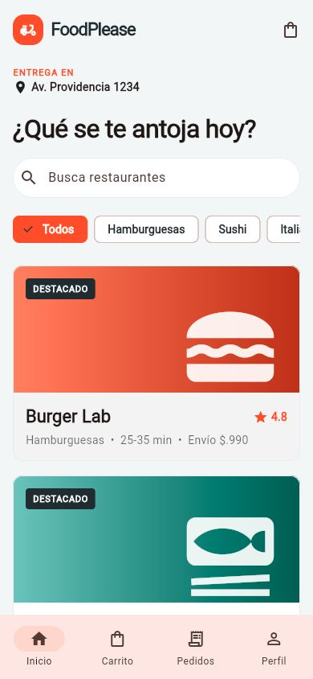
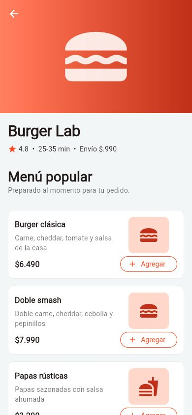
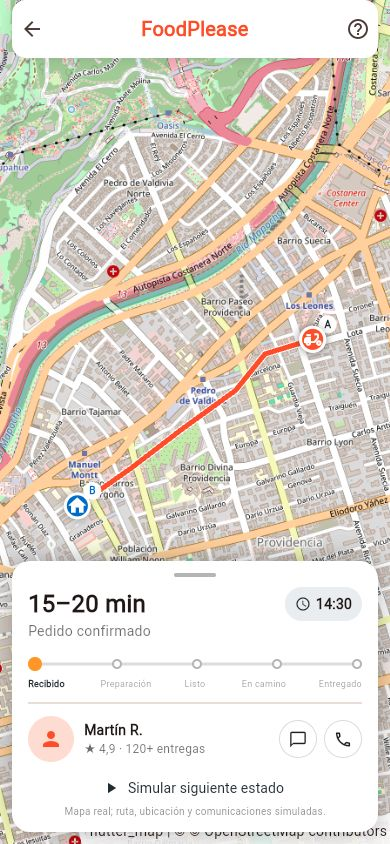
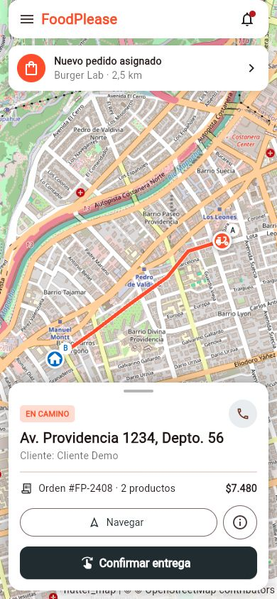

<p align="center">
  
</p>

# FoodPlease · MVP académico

Aplicación móvil Flutter visual y navegable para APTC106, Semana 9, Sumativa 3. Continúa la propuesta del Grupo 11 y demuestra el ciclo completo de un pedido con datos locales.

> **Alcance:** este repositorio contiene exclusivamente el MVP de la aplicación móvil FoodPlease. No incluye una plataforma web independiente. El cliente dispone del flujo completo y los roles de restaurante y repartidor se representan mediante vistas demostrativas dentro de la misma aplicación Flutter.

## Vista general

| Inicio y restaurantes | Menú del restaurante |
|---|---|
|  |  |

| Seguimiento del cliente | Entrega del repartidor |
|---|---|
|  |  |

## Demostración

- Correo precargado: `cliente@foodplease.cl`
- Contraseña precargada: `demo1234`
- El registro acepta cualquier nombre, correo válido y contraseña de 6 o más caracteres.
- Autenticación, pago, GPS, notificaciones, asignación y API son **simulaciones locales**.

## Funcionalidades implementadas

- Inicio de sesión y registro con validaciones básicas.
- Inicio con búsqueda, categorías y restaurantes ficticios consistentes.
- Detalle, menú y agregado al carrito.
- Carrito con suma/resta de cantidades, despacho y total.
- Selección de medio de pago simulado y confirmación.
- Seguimiento manual por cinco estados: recibido, preparación, listo, en camino y entregado.
- Mapa interactivo de OpenStreetMap con puntos A/B y ruta precargada; la posición avanza con la simulación.
- Historial, perfil y cierre de sesión.
- Estados vacíos para búsquedas, carrito y pedidos.
- Vistas móviles demostrativas para restaurante y repartidor, con actualización del pedido, ruta, detalle y confirmación de entrega.
- Diseño responsive basado en Stitch para teléfono Android estándar (referencia 390 × 844).

## Ejecución

Requiere Flutter 3.47.0 y Dart 3.13.0.

```bash
flutter pub get
flutter emulators --launch medium_phone
flutter run -d medium_phone
```

### Descargar el APK desde GitHub

Cada cambio enviado a `main` genera un APK mediante GitHub Actions. También puede iniciarse manualmente desde **Actions → Build FoodPlease APK → Run workflow**. Al finalizar, el archivo está disponible en **Artifacts → FoodPlease-APK** y se descarga como `FoodPlease.apk`.

Al publicar una etiqueta con formato `v*` —por ejemplo, `v1.0.0`— el mismo flujo crea además una **GitHub Release** y adjunta `FoodPlease.apk` como descarga permanente del repositorio:

```bash
git tag v1.0.0
git push origin v1.0.0
```

El artefacto de Actions se conserva durante 30 días; el archivo adjunto a una Release permanece disponible hasta eliminar esa publicación. Ambos utilizan firma de depuración, adecuada para instalar y demostrar este MVP académico, pero no para publicar en Google Play.

Verificación:

```bash
dart format --output=none --set-exit-if-changed lib test
flutter analyze
flutter test
flutter build apk --debug
```

## Arquitectura

El código se organiza por feature. `app/` compone la aplicación y mantiene el estado coordinador; `core/` contiene piezas transversales; cada feature encapsula su presentación y, cuando corresponde, dominio y datos:

```text
lib/
├── main.dart
├── app/
│   ├── app.dart
│   ├── app_scope.dart
│   └── app_state.dart
├── core/
│   ├── theme/app_theme.dart
│   ├── maps/delivery_map.dart
│   ├── utils/currency.dart
│   └── widgets/
└── features/
    ├── auth/presentation/
    ├── catalog/{domain,data,presentation}/
    ├── cart/presentation/
    ├── checkout/presentation/
    ├── courier/presentation/
    ├── tracking/presentation/
    ├── orders/presentation/
    ├── profile/presentation/
    └── shell/presentation/
```

Las dependencias apuntan desde presentación hacia estado/dominio y nunca desde `core` hacia una feature. El catálogo separa modelos y repositorio simulado, dejando un punto claro para sustituir los datos locales por una implementación REST. Para el tamaño actual del MVP, `AppState` actúa como coordinador observable; al incorporar backend puede dividirse en controladores por feature sin reescribir las pantallas.

El MVP utiliza una única aplicación móvil con experiencias diferenciadas por rol:

```text
Aplicación móvil FoodPlease (Flutter)
├── Cliente: recorrido completo de compra y seguimiento
├── Restaurante: vista demostrativa de gestión del pedido
└── Repartidor: vista demostrativa de ruta y entrega
        │
        └── Estado y repositorios locales simulados
                └── Evolución futura: API REST → servicios → base central
```

No se construyó una plataforma web. La aplicación cliente está desarrollada como flujo completo; el repartidor dispone de un recorrido demostrativo de ruta y confirmación, y el restaurante mantiene una vista móvil operativa acotada. No existe backend ni sincronización real entre dispositivos.

## Decisiones de diseño

- Sistema Stitch “Vibrant Velocity”: naranja `#FF5722`, carbón `#263238`, fondo `#F5F7F8`, Inter, retícula de 8 px y radios de 12 px.
- Ícono oficial “FoodPlease App Icon” recuperado desde Stitch y aplicado a Android y a la marca interna.
- Jerarquía de alto contraste para acelerar búsqueda, elección y confirmación.
- Espectro logístico por estados: ámbar, celeste, naranja, morado y verde.
- Iconografía y gradientes propios de Material para no depender de assets con licencias externas ni red.
- Datos locales deterministas para que la evaluación sea repetible; únicamente la cartografía requiere conexión para cargar tiles.
- Mapas de [OpenStreetMap](https://www.openstreetmap.org/) con atribución visible y ruta A/B simulada.

## Alcance pendiente

- API REST, persistencia, autenticación segura y autorización por roles.
- Pasarela de pago, cálculo dinámico de rutas, GPS, notificaciones push y ubicación real.
- Ampliación de los recorridos móviles de restaurante y repartidor, actualmente demostrativos.
- Accesibilidad ampliada, internacionalización y pruebas de integración/E2E.
- Firma de producción y publicación en Google Play.

## Estado de verificación

- `flutter analyze`: sin incidencias.
- `flutter test`: 3 pruebas aprobadas.
- `flutter build apk --debug`: APK generado correctamente.

Las imágenes visibles en este README se mantienen en `assets/readme/`. Los artefactos locales de compilación, capturas de trabajo y documentación de entrega están excluidos mediante `.gitignore`.
